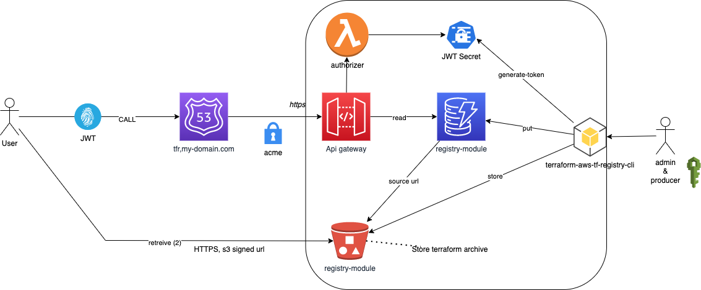

# Terraform Private Registry for AWS

This Terraform module deploys a private registry for Terraform on AWS, allowing you to publish and consume your own modules independently of the public registry at [`registry.terraform.io`](https://registry.terraform.io/).

```hcl
module "awesomeapp" {
  source = "registry.example.com/myorg/awesomeapp/aws"
  version = "1.0.0"
}
```

Battle-tested in production for 2+ years. Costs less than $10/month.

This is a fork from [terraform-aws-tf-registry](https://github.com/apparentlymart/terraform-aws-tf-registry) by Martin Atkins.


## Architecture



The registry implements [Terraform's module registry protocol](https://developer.hashicorp.com/terraform/internals/module-registry-protocol) using:

- **API Gateway** — serves the registry HTTP API with JWT-based authorization
- **DynamoDB** — stores the module index (namespace/name/provider → versions)
- **S3** — stores module artifacts (zip files)
- **Lambda (authorizer)** — validates JWT bearer tokens
- **Lambda (download)** — generates S3 presigned URLs for module downloads
- **Secrets Manager** — stores the JWT signing key

Key design choices:

- Presigned S3 URLs allow cross-account/cross-platform access without sharing AWS credentials
- The `s3::` prefix in module sources triggers Terraform's AWS-style authentication ([docs](https://developer.hashicorp.com/terraform/language/modules/sources#s3-bucket))
- Multi-account sharing is simplified — only JWT tokens need to be distributed

For implementation details, see the [registry-service module documentation](./modules/registry-service/README.md).


## Usage

### Deploy the registry

See the full example at [example/registry](./example/registry/main.tf).

```hcl
module "registry" {
  source  = "geronimo-iia/tf-registry/aws"
  version = "~> 1.3"

  name_prefix = "registry"

  storage = {
    dynamodb = { name = "my-registry-tfe" }
    bucket   = { name = "my-registry-tfe" }
  }

  friendly_hostname = {
    host                = "registry.example.com"
    acm_certificate_arn = aws_acm_certificate.cert.arn
  }

  tags = {
    Product          = "Registry"
    ProductComponent = "terraform"
  }
}

# Point DNS to the registry
resource "aws_route53_record" "registry" {
  zone_id = data.aws_route53_zone.main.zone_id
  name    = "registry.example.com."
  type    = "A"
  alias {
    name                   = module.registry.dns_alias.hostname
    zone_id                = module.registry.dns_alias.route53_zone_id
    evaluate_target_health = true
  }
}
```

### Configure Terraform CLI

Create a `~/.terraformrc` file:

```hcl
credentials "registry.example.com" {
  token = "<your-jwt-token>"
}
```

### Consume modules

```hcl
module "vpc" {
  source  = "registry.example.com/infra/vpc/aws"
  version = "2.1.0"
}
```

### Publish modules

Use the [terraform-aws-tf-registry-cli](https://github.com/geronimo-iia/terraform-aws-tf-registry-cli) Python client to publish modules and manage the registry.


## Production tips

1. Fork this project into your enterprise git server and add a remote tracking this repository
2. Deploy using the [example/registry](./example/registry/) as a starting point — see the [step-by-step guide](./example/registry/readme.md) for deploy, configure, release, and pull workflow
3. Publish a test module, verify DynamoDB entries, run `terraform init`
4. Integrate the [CLI client](https://github.com/geronimo-iia/terraform-aws-tf-registry-cli) into your CI/CD pipeline
5. See [additional notes](./docs/note.md) for operational guidance


## References

- [Terraform Module Registry Protocol](https://developer.hashicorp.com/terraform/internals/module-registry-protocol)
- [API Gateway Lambda Authorizer](https://docs.aws.amazon.com/apigateway/latest/developerguide/apigateway-use-lambda-authorizer.html)
- [Original registry](https://github.com/apparentlymart/terraform-aws-tf-registry) by Martin Atkins


<!-- BEGIN_TF_DOCS -->
## Requirements

| Name | Version |
| ---- | ------- |
| <a name="requirement_terraform"></a> [terraform](#requirement\_terraform) | >= 1.7.0 |
| <a name="requirement_archive"></a> [archive](#requirement\_archive) | ~> 2.8 |
| <a name="requirement_aws"></a> [aws](#requirement\_aws) | ~> 5.90 |
| <a name="requirement_external"></a> [external](#requirement\_external) | ~> 2.3 |
| <a name="requirement_null"></a> [null](#requirement\_null) | ~> 3.2 |
| <a name="requirement_random"></a> [random](#requirement\_random) | ~> 3.5 |

## Providers

| Name | Version |
| ---- | ------- |
| <a name="provider_null"></a> [null](#provider\_null) | 3.3.0 |

## Modules

| Name | Source | Version |
| ---- | ------ | ------- |
| <a name="module_authorizer"></a> [authorizer](#module\_authorizer) | ./modules/registry-authorizer | n/a |
| <a name="module_download"></a> [download](#module\_download) | ./modules/registry-download | n/a |
| <a name="module_jwt"></a> [jwt](#module\_jwt) | ./modules/registry-jwt | n/a |
| <a name="module_registry"></a> [registry](#module\_registry) | ./modules/registry-service | n/a |
| <a name="module_store"></a> [store](#module\_store) | ./modules/registry-store | n/a |

## Resources

| Name | Type |
| ---- | ---- |
| [null_resource.apigateway_create_deployment](https://registry.terraform.io/providers/hashicorp/null/latest/docs/resources/resource) | resource |

## Inputs

| Name | Description | Type | Default | Required |
| ---- | ----------- | ---- | ------- | :------: |
| <a name="input_api_access_policy"></a> [api\_access\_policy](#input\_api\_access\_policy) | If using a Private API requires you to have an access policy configured and accepts a string, but must be valid json. Defaults to Null | `string` | `null` | no |
| <a name="input_api_type"></a> [api\_type](#input\_api\_type) | Sets API type if you want a private API without a custom domain name, defaults to EDGE for public access | `list(string)` | <pre>[<br/>  "EDGE"<br/>]</pre> | no |
| <a name="input_domain_security_policy"></a> [domain\_security\_policy](#input\_domain\_security\_policy) | Sets the TLS version to desired state, defaults to 1.2 | `string` | `"TLS_1_2"` | no |
| <a name="input_dynamodb_enable_point_in_time_recovery"></a> [dynamodb\_enable\_point\_in\_time\_recovery](#input\_dynamodb\_enable\_point\_in\_time\_recovery) | Enable DynamoDB point in time recovery | `bool` | `true` | no |
| <a name="input_friendly_hostname"></a> [friendly\_hostname](#input\_friendly\_hostname) | Configures a "friendly hostname" that will be used to reference objects in this registry. If this is set, the given hostname and certificate will be registered against the created API. Can be left unset if the service discovery information will be separately published at the friendly hostname, using the "services" output value. | <pre>object({<br/>    host                = string<br/>    acm_certificate_arn = string<br/>  })</pre> | `null` | no |
| <a name="input_kms_key_id"></a> [kms\_key\_id](#input\_kms\_key\_id) | Optional custom kms key id (default aws/secretsmanager) | `string` | `null` | no |
| <a name="input_name_prefix"></a> [name\_prefix](#input\_name\_prefix) | A name to use as the prefix for the created API Gateway REST API, DynamoDB tables, etc | `string` | `"terraform-registry"` | no |
| <a name="input_s3_public_access"></a> [s3\_public\_access](#input\_s3\_public\_access) | Bucket Public Access Block | <pre>object({<br/>    block_public_acls       = bool,<br/>    ignore_public_acls      = bool,<br/>    block_public_policy     = bool,<br/>    restrict_public_buckets = bool<br/>  })</pre> | <pre>{<br/>  "block_public_acls": true,<br/>  "block_public_policy": true,<br/>  "ignore_public_acls": true,<br/>  "restrict_public_buckets": true<br/>}</pre> | no |
| <a name="input_secret_key_name"></a> [secret\_key\_name](#input\_secret\_key\_name) | Optional AWS Secret name to store JWT secret | `string` | `null` | no |
| <a name="input_storage"></a> [storage](#input\_storage) | n/a | <pre>object({<br/>    dynamodb = object({<br/>      name         = optional(string, null)<br/>      billing_mode = optional(string, "PAY_PER_REQUEST")<br/>      read         = optional(number, 1)<br/>      write        = optional(number, 1)<br/>    })<br/>    bucket = object({<br/>      name = optional(string, null)<br/>    })<br/>  })</pre> | <pre>{<br/>  "bucket": {<br/>    "name": null<br/>  },<br/>  "dynamodb": {<br/>    "billing_mode": "PAY_PER_REQUEST",<br/>    "name": null,<br/>    "read": 1,<br/>    "write": 1<br/>  }<br/>}</pre> | no |
| <a name="input_tags"></a> [tags](#input\_tags) | Resource tags | `map(string)` | `{}` | no |
| <a name="input_vpc_endpoint_ids"></a> [vpc\_endpoint\_ids](#input\_vpc\_endpoint\_ids) | Sets the VPC endpoint ID for a private API, defaults to null | `list(string)` | `null` | no |

## Outputs

| Name | Description |
| ---- | ----------- |
| <a name="output_bucket_arn"></a> [bucket\_arn](#output\_bucket\_arn) | Bucket arn |
| <a name="output_bucket_name"></a> [bucket\_name](#output\_bucket\_name) | Bucket name |
| <a name="output_dns_alias"></a> [dns\_alias](#output\_dns\_alias) | If the friendly\_hostname input variable is set, this exports the hostname and Route53 zone id that should be used to point the friendly hostname at the registry API. If not using Route53 for DNS, you can alternatively create a regular CNAME record to the returned hostname. If friendly hostname is not enabled then this output is always null. |
| <a name="output_dynamodb_table_arn"></a> [dynamodb\_table\_arn](#output\_dynamodb\_table\_arn) | Dynamodb table arn |
| <a name="output_dynamodb_table_name"></a> [dynamodb\_table\_name](#output\_dynamodb\_table\_name) | Dynamodb table name |
| <a name="output_registry_secret_key_name"></a> [registry\_secret\_key\_name](#output\_registry\_secret\_key\_name) | JWT secret key name in aws secret manager |
| <a name="output_rest_api_id"></a> [rest\_api\_id](#output\_rest\_api\_id) | The id of the API Gateway REST API managed by this module. |
| <a name="output_rest_api_stage_name"></a> [rest\_api\_stage\_name](#output\_rest\_api\_stage\_name) | The id of the API Gateway deployment stage managed by this module. |
| <a name="output_services"></a> [services](#output\_services) | A service discovery configuration map for the deployed services. A JSON-serialized version of this should be published at /.well-known/terraform.json on an HTTPS server running at the friendly hostname for this registry. |
<!-- END_TF_DOCS -->
